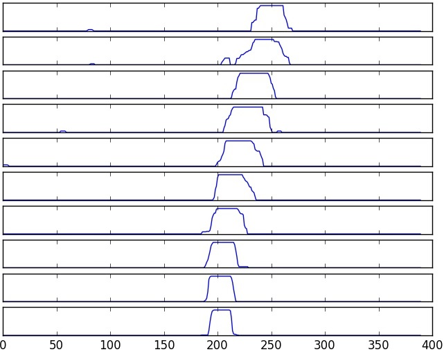
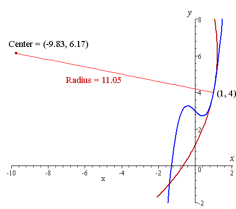
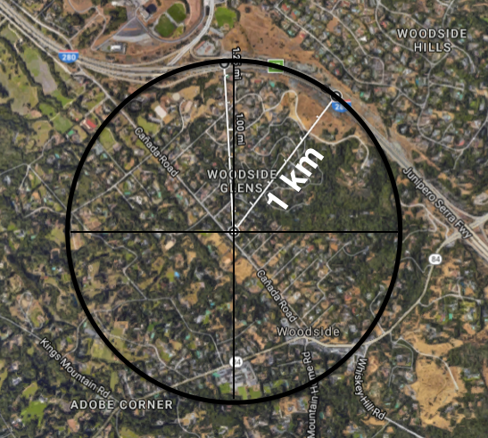

##Writeup Template
###You can use this file as a template for your writeup if you want to submit it as a markdown file, but feel free to use some other method and submit a pdf if you prefer.

---

**Advanced Lane Finding Project**

The goals / steps of this project are the following:

* Compute the camera calibration matrix and distortion coefficients given a set of chessboard images.
* Apply a distortion correction to raw images.
* Use color transforms, gradients, etc., to create a thresholded binary image.
* Apply a perspective transform to rectify binary image ("birds-eye view").
* Detect lane pixels and fit to find the lane boundary.
* Determine the curvature of the lane and vehicle position with respect to center.
* Warp the detected lane boundaries back onto the original image.
* Output visual display of the lane boundaries and numerical estimation of lane curvature and vehicle position.

[//]: # (Image References)

[image1]: ./examples/undistort_output.png "Undistorted"
[image2]: ./test_images/test1.jpg "Road Transformed"
[image3]: ./examples/binary_combo_example.jpg "Binary Example"
[image4]: ./examples/warped_straight_lines.jpg "Warp Example"
[image5]: ./examples/color_fit_lines.jpg "Fit Visual"
[image6]: ./examples/example_output.jpg "Output"
[video1]: ./project_video.mp4 "Video"


[image9]: ./writeup_images/test4_result.png "Test4 Result"

[image10]: ./writeup_images/chessboard.png "Chessboard"
[image11]: ./writeup_images/camera_calibration.png "Calibration"

[image12]: ./writeup_images/hsv_hls.png "hsv hls"
[image13]: ./writeup_images/test4_white_yellow.png "Test4 White yellow selection"
[image14]: ./writeup_images/test4_binary.png "Test4 Binary"

[image15]: ./writeup_images/test4_warp.png "Test4 Warp"
[image16]: ./writeup_images/warp1.jpg "Warp1"
[image17]: ./writeup_images/warp2.jpg "Warp2"

[image18]: ./writeup_images/test4_histogram_view.png "Test4 Histogram view"
[image19]: ./writeup_images/test4_histogram.png "Histogram"
[image20]: ./writeup_images/histogram_per_window.jpg "Histogram per window"

[image21]: ./writeup_images/test4_find_lines.png "Test4 find lines"

[image22]: ./writeup_images/curvature1.jpg "Curvature1"
[image23]: ./writeup_images/curvature2.png "Curvature1"
[image24]: ./writeup_images/curvature3.png "Curvature3"

[image25]: ./writeup_images/project_video_sample1.gif "Video sample"


[video10]: ./project_video_out1.mp4 "Video"


## [Rubric](https://review.udacity.com/#!/rubrics/571/view) Points
###Here I will consider the rubric points individually and describe how I addressed each point in my implementation.  

---
###Writeup / README

![alt text][image9]


Here's a [link to my video result](https://www.youtube.com/watch?v=dNlqlQh5f-4)


####1. Provide a Writeup / README that includes all the rubric points and how you addressed each one.  You can submit your writeup as markdown or pdf.  [Here](https://github.com/udacity/CarND-Advanced-Lane-Lines/blob/master/writeup_template.md) is a template writeup for this project you can use as a guide and a starting point.  

You're reading it!
###Camera Calibration

####1. Briefly state how you computed the camera matrix and distortion coefficients. Provide an example of a distortion corrected calibration image.

The code for this step is contained in the first code cell of the IPython notebook located in "./examples/example.ipynb" (or in lines # through # of the file called `some_file.py`).  

I start by preparing "object points", which will be the (x, y, z) coordinates of the chessboard corners in the world. Here I am assuming the chessboard is fixed on the (x, y) plane at z=0, such that the object points are the same for each calibration image.  Thus, `objp` is just a replicated array of coordinates, and `objpoints` will be appended with a copy of it every time I successfully detect all chessboard corners in a test image.  `imgpoints` will be appended with the (x, y) pixel position of each of the corners in the image plane with each successful chessboard detection.  

I then used the output `objpoints` and `imgpoints` to compute the camera calibration and distortion coefficients using the `cv2.calibrateCamera()` function.  I applied this distortion correction to the test image using the `cv2.undistort()` function and obtained this result: 

![alt text][image10]

###Pipeline (single images)


```python
def process_image(img):    
    img = undistort(img, mtx, dist)
    # Keep the untransformed image for later
    orig = img.copy()
    img = select_white_yellow(img)
    img = grayscale(img)        
    img = transform.warp(img)
    out_img = tracker.find_lines(img, debug = True)
    curvature = tracker.find_curvature()   
    result = tracker.plot_poly_orig(orig)
    cv2.putText(final, 'Curvature: {}m'.format(int(curvature)), (10, 50), cv2.FONT_HERSHEY_DUPLEX, 1.5, (255,255,255))
    offset = tracker.find_offset()
    cv2.putText(final, 'Lane Offset: {}m'.format(round(offset, 4)), (10, 100), cv2.FONT_HERSHEY_DUPLEX, 1.5, (255,255,255))
    return result
```

####1. Provide an example of a distortion-corrected image.
To demonstrate this step, I will describe how I apply the distortion correction to one of the test images like this one:
![alt text][image11]
####2. Describe how (and identify where in your code) you used color transforms, gradients or other methods to create a thresholded binary image.  Provide an example of a binary image result.
I used a combination of color and gradient thresholds to generate a binary image (thresholding steps at lines # through # in `another_file.py`).  Here's an example of my output for this step.  (note: this is not actually from one of the test images)

<p align="center">
     
     <br>hsv_hls.png
</p>


```python
def select_white_yellow(img):
    """Applies color selection for white and yellow"""
    hls_img = cv2.cvtColor(img, cv2.COLOR_RGB2HLS)
    
    # white color mask
    lower = np.array([  0, 200,   0], dtype="uint8")
    upper = np.array([255, 255, 255], dtype="uint8")
    white_mask = cv2.inRange(hls_img, lower, upper)
    
    # yellow color mask
    lower = np.array([ 10,   0, 100], dtype="uint8")
    upper = np.array([ 40, 255, 255], dtype="uint8")
    yellow_mask = cv2.inRange(hls_img, lower, upper)
    # combine the mask
    
    white_yellow_mask = cv2.bitwise_or(white_mask, yellow_mask)
    return cv2.bitwise_and(img, img, mask = white_yellow_mask)
```
![alt text][image13]
![alt text][image14]

####3. Describe how (and identify where in your code) you performed a perspective transform and provide an example of a transformed image.

The code for my perspective transform includes a function called `warper()`, which appears in lines 1 through 8 in the file `example.py` (output_images/examples/example.py) (or, for example, in the 3rd code cell of the IPython notebook).  The `warper()` function takes as inputs an image (`img`), as well as source (`src`) and destination (`dst`) points.  I chose the hardcode the source and destination points in the following manner:

```python
class Transformer():
    def __init__(self, img):
        (h, w) = (img.shape[0], img.shape[1]) # 720, 1280
        src = np.float32([[w // 2 - 76, h * .625], [w // 2 + 76, h * .625], [-100, h], [w + 100, h]])
        dst = np.float32([[100, 0], [w - 100, 0], [100, h], [w - 100, h]])    
        
        #src = np.array([[585, 460], [203, 720], [1127, 720], [695, 460]]).astype(np.float32)
        #dst = np.array([[320, 0], [320, 720], [960, 720], [960, 0]]).astype(np.float32)
        
        self.M = cv2.getPerspectiveTransform(src, dst)
        self.Minv = cv2.getPerspectiveTransform(dst, src)
        
    def warp(self, img):
        return cv2.warpPerspective(img, self.M, (img.shape[1], img.shape[0]))
    
    def unwarp(self, img):
        return cv2.warpPerspective(img, self.Minv, (img.shape[1], img.shape[0]))
```

This resulted in the following source and destination points:

| Source        | Destination   | 
|:-------------:|:-------------:| 
| 585, 460      | 320, 0        | 
| 203, 720      | 320, 720      |
| 1127, 720     | 960, 720      |
| 695, 460      | 960, 0        |

I verified that my perspective transform was working as expected by drawing the `src` and `dst` points onto a test image and its warped counterpart to verify that the lines appear parallel in the warped image.

![alt text][image15]
![alt text][image16]
![alt text][image17]

####4. Describe how (and identify where in your code) you identified lane-line pixels and fit their positions with a polynomial?

Then I did some other stuff and fit my lane lines with a 2nd order polynomial kinda like this:

![alt text][image18]

<p align="center">
     
     <br>histogram_per_window.jpg
</p>

####5. Describe how (and identify where in your code) you calculated the radius of curvature of the lane and the position of the vehicle with respect to center.

I did this in lines # through # in my code in `my_other_file.py`

<p align="center">
     
     <br>curvature1.jpg
</p>


```python
    # Calculate the lane line curvature
    def find_curvature(self):
        yscale = 30 / 720 # meters per pixel in y dimension
        xscale = 3.7 / 700 # meters per pixel in x dimension

        # Convert polynomial to set of points for refitting
        ploty = np.linspace(0, self.h - 1, self.h)
        
        l_poly = self.last_l_poly
        plotx = l_poly[0] * ploty ** 2 + l_poly[1] * ploty + l_poly[2]
        # Fit new polynomial
        poly_cur = np.polyfit(ploty * yscale, plotx * xscale, 2)
        # Calculate curve radius
        l_curv = ((1 + (2 * poly_cur[0] * np.max(ploty) * yscale + poly_cur[1]) ** 2) ** 1.5) / np.absolute(2 * poly_cur[0])
        
        r_poly = self.last_r_poly.copy()
        plotx = r_poly[0] * ploty ** 2 + r_poly[1] * ploty + r_poly[2]
        # Fit new polynomial
        poly_cur = np.polyfit(ploty * yscale, plotx * xscale, 2)
        # Calculate curve radius
        r_curv = ((1 + (2 * poly_cur[0] * np.max(ploty) * yscale + poly_cur[1]) ** 2) ** 1.5) / np.absolute(2 * poly_cur[0])
          
        # Calculate the lane curvature radius
        curv = (l_curv + r_curv) / 2.0
        
        # Update polynomials using weighted average with last frame
        if self.last_curv is None:
            # If first frame, initialise poly
            self.last_curv = curv
        else:
            # Otherwise, update poly with low pass filtering
            curv = 0.8 * self.last_curv + 0.2 * curv
            self.last_curv = curv
        
        return curv
```

<p align="center">
     
     <br>curvature2.png
</p>

<p align="center">
     
     <br>curvature3.png
</p>

```python
    # Find the offset of the car and the base of the lane lines
    def find_offset(self):
        l_poly = self.last_l_poly
        r_poly = self.last_r_poly
        
        lane_width = 3.7  # metres
        h = self.h  # height of image (index of image bottom)
        w = self.w  # width of image

        # Find the bottom pixel of the lane lines
        l_px = l_poly[0] * h ** 2 + l_poly[1] * h + l_poly[2]
        r_px = r_poly[0] * h ** 2 + r_poly[1] * h + r_poly[2]

        # Find the midpoint
        midpoint = (l_px + r_px) / 2.0

        # Find the offset from the centre of the frame, and then multiply by scale
        offset = (w/2 - midpoint) 
        
        # Find the number of pixels per real metre
        scale = lane_width / np.abs(l_px - r_px)
        offset *= scale
        
        return offset
```

####6. Provide an example image of your result plotted back down onto the road such that the lane area is identified clearly.

I implemented this step in lines # through # in my code in `yet_another_file.py` in the function `map_lane()`.  Here is an example of my result on a test image:

![alt text][image9]

```python
    # Plot the polygons on the image
    def plot_poly_orig(self, orig):
        fitl = self.last_l_poly
        fitr = self.last_r_poly
        if fitl == None or fitr == None:
            return orig
        # Draw lines from polynomials
        ploty = np.linspace(0, orig.shape[0]-1, orig.shape[0])
        fitl = fitl[0]*ploty**2 + fitl[1]*ploty + fitl[2]
        fitr = fitr[0]*ploty**2 + fitr[1]*ploty + fitr[2]

        pts_left = np.array([np.transpose(np.vstack([fitl, ploty]))])
        pts_right = np.array([np.flipud(np.transpose(np.vstack([fitr, ploty])))])
        pts = np.hstack((pts_left, pts_right))

        # Create an overlay from the lane lines
        overlay = np.zeros_like(orig).astype(np.uint8)
        cv2.fillPoly(overlay, np.int_([pts]), (0,255, 0))

        # Apply inverse transform to the overlay to plot it on the original road
        overlay = transform.unwarp(overlay)

        # Add the overlay to the original unwarped image
        result = cv2.addWeighted(orig, 1, overlay, 0.3, 0)
        
        s_img = cv2.resize(self.debug_img, (300, 300))
        result[0:300, -1-300:-1] = s_img
        return result
```
---

###Pipeline (video)

####1. Provide a link to your final video output.  Your pipeline should perform reasonably well on the entire project video (wobbly lines are ok but no catastrophic failures that would cause the car to drive off the road!).

Here's a [link to my video result](https://www.youtube.com/watch?v=dNlqlQh5f-4)

---

###Discussion

####1. Briefly discuss any problems / issues you faced in your implementation of this project.  Where will your pipeline likely fail?  What could you do to make it more robust?

Here I'll talk about the approach I took, what techniques I used, what worked and why, where the pipeline might fail and how I might improve it if I were going to pursue this project further.  

