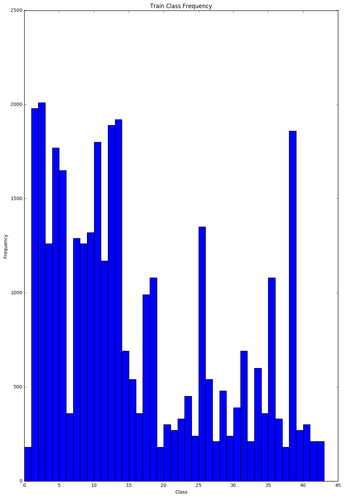
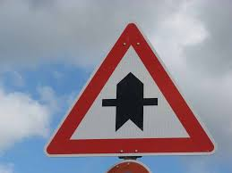
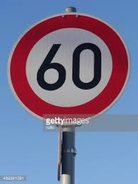
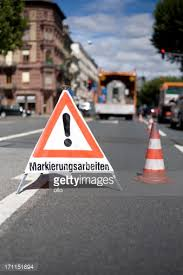
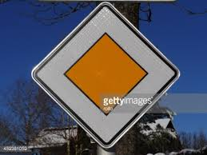
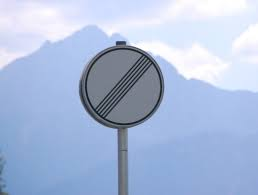

#**Traffic Sign Recognition** 

---

**Build a Traffic Sign Recognition Project**

The goals / steps of this project are the following:
* Load the data set (see below for links to the project data set)
* Explore, summarize and visualize the data set
* Design, train and test a model architecture
* Use the model to make predictions on new images
* Analyze the softmax probabilities of the new images
* Summarize the results with a written report

**Main result and current status:   
Training Set accuracy = 100%, Validation Set accuracy = 99.1%, Test Set accuracy = 97.4%**

[//]: # (Image References)

[classes]: ./examples/unbalanced_classes.png "Visualization of unbalanced classes"
[before]: ./examples/before_geometric_transform.png "Before geometric transform"
[after]: ./examples/after_geometric_transform.png "After geometric transform"
[img1]: ./examples/img1.jpeg "Traffic Sign 1"
[img2]: ./examples/img2.jpeg "Traffic Sign 2"
[img3]: ./examples/img3.jpeg "Traffic Sign 3"
[img4]: ./examples/img4.jpeg "Traffic Sign 4"
[img5]: ./examples/img5.jpeg "Traffic Sign 5"
[img6]: ./examples/img6.jpeg "Traffic Sign 6"
[prediction1]: ./examples/prediction1.png "Prediction for img1"
[prediction2]: ./examples/prediction2.png "Prediction for img2"
[prediction3]: ./examples/prediction3.png "Prediction for img3"
[prediction4]: ./examples/prediction4.png "Prediction for img4"
[prediction5]: ./examples/prediction5.png "Prediction for img5"
[prediction6]: ./examples/prediction6.png "Prediction for img6"

## Rubric Points
###Here I will consider the [rubric points](https://review.udacity.com/#!/rubrics/481/view) individually and describe how I addressed each point in my implementation.  

---
###Writeup / README

####1. Provide a Writeup / README that includes all the rubric points and how you addressed each one. You can submit your writeup as markdown or pdf. You can use this template as a guide for writing the report. The submission includes the project code.

You're reading it! and here is a link to my [project code](https://github.com/PhilippeW83440/SDCND/blob/master/CarND-Traffic-Sign-Classifier-Project/Traffic_Sign_Classifier.ipynb)

**Data Set Summary & Exploration**

####1. Provide a basic summary of the data set and identify where in your code the summary was done. In the code, the analysis should be done using python, numpy and/or pandas methods rather than hardcoding results manually.

The code for this step is contained in the second code cell of the IPython notebook.  

I used the numpy and pandas library to calculate summary statistics of the traffic
signs data set:

* The size of training set is: 34799  
* The size of validation set is: 4410 (a bit more than 10% of the data used during training for cross-validation) 
* The size of test set is: 12630
* The shape of a traffic sign image is: 32x32x3 (3 RGB channels)
* The number of unique classes/labels in the data set is: 43

####2. Include an exploratory visualization of the dataset and identify where the code is in your code file.

The code for this step is contained in the third code cell of the IPython notebook.  

Here is an exploratory visualization of the data set.   
It is a bar chart showing how the data is actually unbalanced:  
- 17 classes have more than 1000 training samples, whith peaks at 2000 training samples.
- 19 classes have less than 500 training samples  
  
Ideally we would like to have the training, validation and test sets to be well balanced. So typically this could be a topic for data augmentation to make sure we are dealing with balanced classes.

###Design and Test a Model Architecture

####1. Describe how, and identify where in your code, you preprocessed the image data. What tecniques were chosen and why did you choose these techniques? Consider including images showing the output of each preprocessing technique. Pre-processing refers to techniques such as converting to grayscale, normalization, etc.

The code for this step is contained in the fourth code cell of the IPython notebook.

I am using a per image normalization: per image and per channel, I am computing the mean and standard deviation and changing pixels value to (x - mu) / stddev. Using a per image normalization rather than a global normalization like (x - 128) / 128 type of normalization (assuming all pixels are in a [0, 255] range of values) enabled to improve results significantly.  
I am not converting the images to grayscale: which could have the benefit of faster training times. I tried but got slightly better results with colored images and as the training is pretty fast (around 10 minutes with a GPU 980 TI card), I am sticking to colored images. I have also tried histogram equalization but as per my experiments so far, the key point was doing a **per image normalization**.  

####2. Describe how, and identify where in your code, you set up training, validation and testing data. How much data was in each set? Explain what techniques were used to split the data into these sets. (OPTIONAL: As described in the "Stand Out Suggestions" part of the rubric, if you generated additional data for training, describe why you decided to generate additional data, how you generated the data, identify where in your code, and provide example images of the additional data)

The code for dealing with the data into training and validation sets is contained in the fifth code cell of the IPython notebook.  

During training, a bit more than 10% of data is being used for cross-validation.  
The cross-validation accuracy is used as a trigger for storing the best performing model. So typically the training lasts 50 epochs, but **a new model is being stored and qualified only when cross-validation accuracy is improved**.  
At the beginning of every epoch the training set is shuffled: this is very important.

Also I am using one form of data augmentation: at every epoch I have the ability to derive from the training set a companion training set with modified images. The perturbations used are geometric: rotations, translation, scaling and perspective transforms. So actually **the training set is 2x the original training set, with 50% of the samples, the augmented ones, being geometric transformations of the original ones**. 
My best performing model is making a perturbated copy of the original training set and using this perturbated copy during 8 epochs, before generating a new perturbated copy. And so on during training.  
**This enabled me to get a Validation Accuracy above 99% (while I was at 98% without such, simple and limited data augmenation).**  
I have also noticed that this improved the ability to generalize better and improved results with random traffic sign images retrieved on the web.  

The sixth code cell of the IPython notebook contains the code for augmenting the data set. I decided to generate additional data because ... To add more data to the the data set, I used the following techniques because ... 

Here is an example of an original image and an augmented, with geometric transform, image:

![Before][before]
![After][after]

####3. Describe, and identify where in your code, what your final model architecture looks like including model type, layers, layer sizes, connectivity, etc.) Consider including a diagram and/or table describing the final model.

The code for my final model is located in the seventh cell of the ipython notebook. 

My final model consisted of the following layers:

The starting point was the LeNet model that was improved by:
- adding droput after the non-linearities (RELU) of the fully connected layers. This is a regularization feature to prevent overfitting and enable better generalization.  
- increasing the number of convolution filters: I started with 6 and 16 and gradualy multiplied by 2 as long as I got accuracy imporvements. Good choices are (48 filters for conv1 and 128 filters for conv2)
- I changed the random initialization of the weights by using a smaller standard deviation and it realy helped improved the accuracy. Weights initialization is a key point when dealing with Neural Networks.

The things I have tried and finally rejected were:
- Batch normalization before the relu non linearities. No improvement. Maybe because the per image mean var normalization is already providing benefits and the network here is relativelly small.  
- increasing the size of the fully connected layers: it had almost no impact.  

I have not considered adding a 3rd convolutional layer as the input here is small 32x32 and the size out of the 2nd convolution layer is already down to 5x5. I think much more convolutional layers would make a lot of sense with bigger input images.   

The things I would like to try further:
- using DenseNet or  multi-scale features, which means that convolutional layers’ output is not only forwarded into subsequent layer, but is also branched off and fed together into the first fully connected layer. My first trials were not successful but  with more data augmentation and deeper network this could or should help.  

| Layer         		|     Description	        					| 
|:---------------------:|:---------------------------------------------:| 
| Input         		| 32x32x3 RGB image   							| 
| Convolution 5x5     	| 48 filters: 1x1 stride, valid padding, outputs 28x28x48 	|
| RELU					|	non linearities											|
| Max pooling	      	| 2x2 stride,  outputs 14x14x48 				|
| Convolution 5x5     	| 128 filters: 1x1 stride, valid padding, outputs 10x10x128 	|  
| RELU					|	non linearities											|  
| Max pooling	      	| 2x2 stride,  outputs 5x5x128 	|  
| Flatten | the 3D shape (feature maps) into a flat vector |
| Fully connected		| 120 neurons        									|  
| RELU					|	non linearities											|  
| DROPOUT					|	50% drop during training											|  
| Fully connected		| 84 neurons        									|  
| RELU					|	non linearities											|
| DROPOUT					|	50% drop during training											|
| Softmax				| 43 classes       									|

####4. Describe how, and identify where in your code, you trained your model. The discussion can include the type of optimizer, the batch size, number of epochs and any hyperparameters such as learning rate.

The code for training the model is located in the eigth cell of the ipython notebook. 

I have used 50 epochs and a Batch Size of 128. With around 70.000 trainig samples and by using a local Nvidia GPU GTX 980 TI it makes the training pretty fast (around 10 minutes). I varied the Batch Size without major accuracy changes.  

I am using the Adam Optimizer with a Learning Rate of 1e-3. Compared to default SGD training with momentum, it reduces the number of hyperparameters to train and you do not have to manually tune the Learning Rate decay strategy. So it is easier and less time consuming to use with results that should be very good. 

I implemented and tested L2 regularization but it did not help; most probably because the dropouts are already doing a good job in terms of regularization.  

####5. Describe the approach taken for finding a solution. Include in the discussion the results on the training, validation and test sets and where in the code these were calculated. Your approach may have been an iterative process, in which case, outline the steps you took to get to the final solution and why you chose those steps. Perhaps your solution involved an already well known implementation or architecture. In this case, discuss why you think the architecture is suitable for the current problem.

The code for calculating the accuracy of the model is located in the ninth cell of the Ipython notebook.

My final model results were:
* training set accuracy of: 100%
* validation set accuracy of: 99.1%
* test set accuracy of: 97.4%

  Actually while testing I got at some point Validation Accuracy 99.3% and Test Accuracy 97.8%. But what I am submitting here corresponds to the resuls summarized above.  

**I have used an iterative approach starting with the LeNet architecture provided by the Udacity class as a starting point.
The validation accuracy was 89%.  So I managed to improve up to and above 99%.**    

**I have described my different iterations and trials in the previous sections but here is the summary of the key points leading to improvements compared to LeNet baseline:**
* use different weights initializations: lower the sigma value.
* use dropouts: for regularization
* use more convolutional filters: for better discrimination capabilities. It improves translational invariance which is important when trying to detect an object in an image.
* use per image mean var normalization. The per image being important here.
* use some reduced and simple augmentation with geometric transformations (traing set size: 2x)
* only qualify and store a model when the validation accuracy improves (it is related to early stop as well to prevent over fitting)

So at the end, it is an improved LeNet architecture. So a relativelly small network. And I ended with pretty good results: Validation Accuracy above 99% and Test Accuracy above 97%.

Nevertheless to improve further I think 2 main things should be considered:
- much more data augmentation: something like training set 20x. Also using color jittering on top of geometric transformations.
- dealing with balanced training classes
- more data would enable training of much more complex models. DenseNet and multi-scale features like in the Sermanet paper should be investigated.  
A Test Accuracy above 99% should be feasible: but with much more training data and so bigger training times as well. 

 

###Test a Model on New Images

####1. Choose five German traffic signs found on the web and provide them in the report. For each image, discuss what quality or qualities might be difficult to classify.

Here are six German traffic signs that I found on the web:

!
!
!
!
!
!

Images 1, 2 and 5 should be the easiest to classify.
Images 4 and 6 should be difficult to classify: not cropped at all actually.

####2. Discuss the model's predictions on these new traffic signs and compare the results to predicting on the test set. Identify where in your code predictions were made. At a minimum, discuss what the predictions were, the accuracy on these new predictions, and compare the accuracy to the accuracy on the test set (OPTIONAL: Discuss the results in more detail as described in the "Stand Out Suggestions" part of the rubric).

The code for making predictions on my final model is located in the tenth cell of the Ipython notebook.

Here are the results of the prediction:

| Image			        |     Prediction	        					| 
|:---------------------:|:---------------------------------------------:| 
| Right-of-way at the next intersection     		| Right-of-way at the next intersection 									| 
| Stop   			| Stop										|
| Speed limit (60km/h)				| Speed limit (60km/h)										|
| General caution	      		| General caution				 				|
| Priority Road			| Priority Road      							|
| End of all speed and passing limits			| Speed limit (60km/h)     							|

The model was able to correctly guess 5 of the 6 traffic signs, which gives an accuracy of 83.3% (with just 6 images)  
The accuracy on the test set used previously  is 97.4%  (with more than 12.000 images)

Now of course, the analysis of these 6 images is just illustrative: we would need much more images to draw aconclusion. Also in a full real pipeline, we would first deal with a detection stage, detecting traffic signs and dealing with appropriate cropping before feeding the Traffic Sign Classifier.

####3. Describe how certain the model is when predicting on each of the five new images by looking at the softmax probabilities for each prediction and identify where in your code softmax probabilities were outputted. Provide the top 5 softmax probabilities for each image along with the sign type of each probability. (OPTIONAL: as described in the "Stand Out Suggestions" part of the rubric, visualizations can also be provided such as bar charts)

The code for making predictions on my final model is located in the 11th cell of the Ipython notebook.

For images 1,2,3 and 5, the softmax probability is close to 1: so the model has a very high confidence in these predictions.
Which is good: even if the images are clean, it is good to notice that the confidence is so high.
For image 4: the caution sign, it is a difficult one as the image is not cropped at all but nevertheless the softmax probability for this class is clearly the highest (close to 0.5) while the competing ones, ranking 2 and  3, are below 0.1.
Note that while training without data augmentation (with geometric transformations), this image was not correctly predicted. So here we benefit from this training with additional transformed data.
The image 6 is not recognised: the traffic sign elected is nevertheless a traffic sign that has some similarity in terms of shape.

| Probability         	|     Prediction	        					| 
|:---------------------:|:---------------------------------------------:| 
| 1.00         			| Right-of-way at the next intersection  									| 
| 0.99     				| Stop 										|
| 1.00					| Speed limit (60km/h)										|
| 0.48      			| General caution					 				|
| 1.00				    | Priority Road     							|
| 0.41			    | Speed limit (60km/h)      							|

![alt text][prediction1] ![alt text][prediction2] ![alt text][prediction3] 
![alt text][prediction4] ![alt text][prediction5] ![alt text][prediction6]

